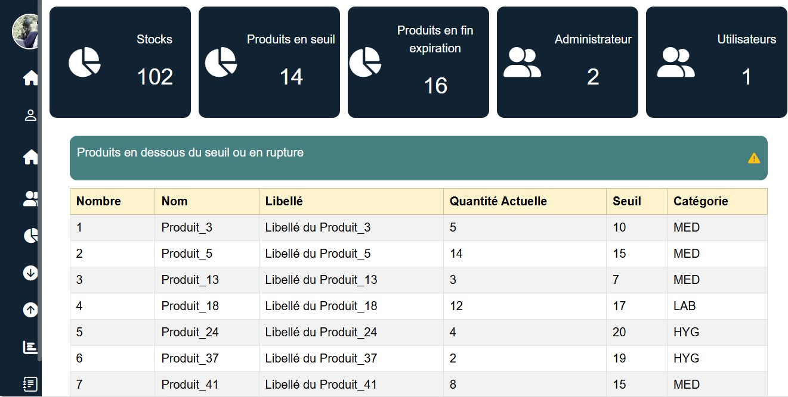
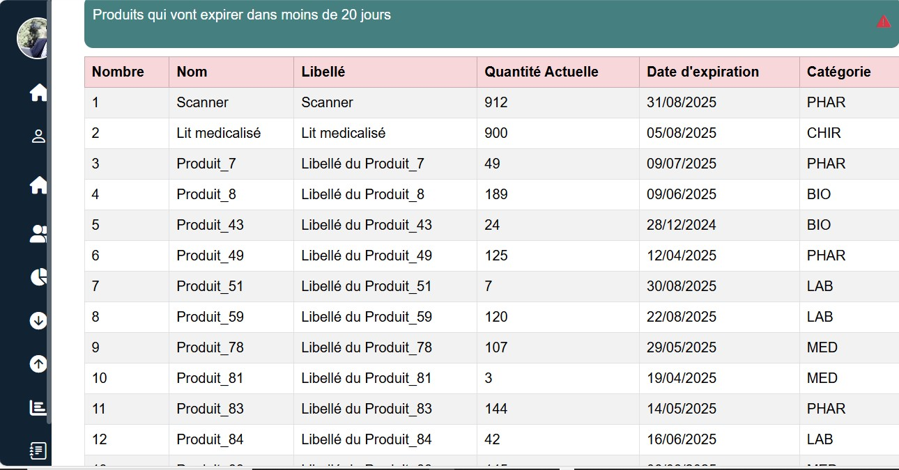
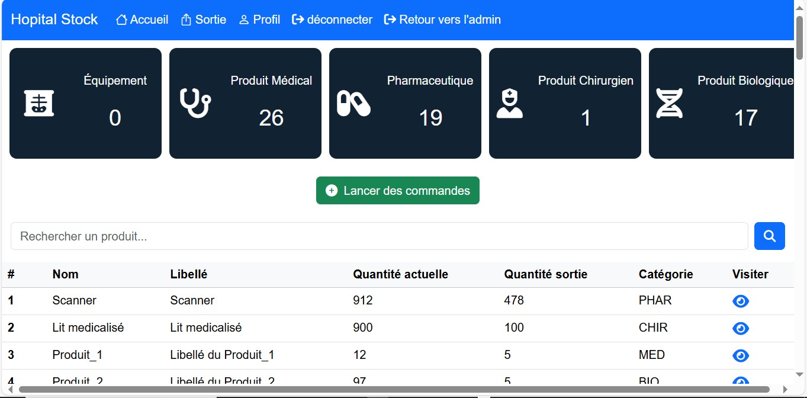
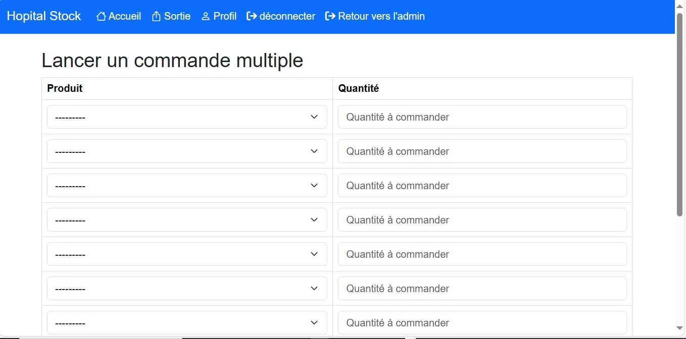

# Gestion de stock d'un hôpital

Ce projet est une application développée en **Django** qui permet de gérer le stock de médicaments et de matériels dans un hôpital.

## Fonctionnalités principales
- Gestion des produits (ajout, modification, suppression)
- Gestion des quantités en stock
- Export en **PDF** et **Excel**
- Génération de rapports (PDF, Excel)
- Système d’authentification des utilisateurs
- Possibilité d'ajouter des produits via un fichier Excel

## Prérequis
- Python 3.10+  
- pip  
- virtualenv (recommandé)
- Base de données : SQL
- WAMP (Windows Apache MySQL PHP)

## Installation
```bash
git clone https://github.com/Dedahi-SDH/Gestion-de-stock-d-un-hopital.git
cd Gestion-de-stock-d-un-hopital

# Créer un environnement virtuel (recommandé)
python -m venv env
# Sur Linux / Mac
source env/bin/activate
# Sur Windows
env\Scripts\activate

# Installer les dépendances
pip install -r requirements.txt
```

## Utilisation
``` bash
# Lancer le serveur Django
python manage.py runserver
```

## Images des taches principales sur l'application

- Interface d'administrations
  



- Exemple du Profil d'utilisateur
  


- Interface d'utilisateur
  


- Lancement de (s) Commande (s)
  


- Auteur
Développé par : Med Abdellahi Sid'ahmed (Dedahi-SDH)
